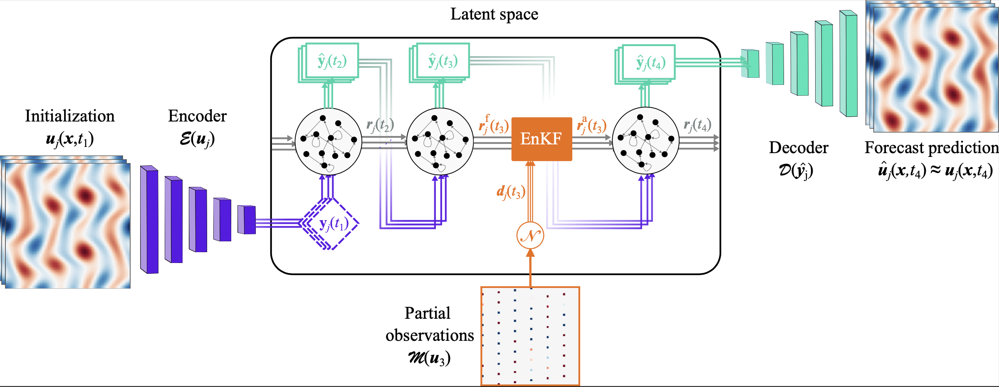

# DA-CAE-ESN

## Introduction

This repository demonstrates the use of data assimilation (DA) within the Convolutional Autoencoder Echo State Network (CAE-ESN) framework. The method assimilates partial and noisy observations into the latent forecast of high-dimensional chaotic systems, enabling real-time and time-accurate predictions of spatiotemporal chaos. Related work can also be found in [Magrilab LatentStability](https://github.com/Magrilab/LatentStability).
<p align='center'>

</p>

If you use this repository, please cite the following work:
**Plain text:**

> Elise Özalp, Andrea Nvoa, Luca Magri.  
> *Real-time prediction of spatio-temporal chaos with autoencoders from sparse data.*  
> arXiv preprint arXiv:XXXX.XXXXX, 2025.
**BibTeX:**
```bibtex
@article{oezalp2025realtime,
  author  = {Elise Oezalp and Andrea Novoa and Luca Magri},
  title   = {Real-time prediction of spatio-temporal chaos with autoencoders from sparse data},
  journal = {arXiv preprint arXiv:XXXX.XXXXX},
  year    = {2025}
} 
```
### Components
This framework consists of three main components:
- **CAE training**  
  Learns a compact latent representation of the full-state dynamics.

- **ESN training**  
  Forecasts the temporal evolution in the latent space.

- **Ensemble Kalman Filter (EnKF)**  
  Performs data assimilation by correcting latent forecasts using sparse and noisy observations.

### Demonstrated Systems
We demonstrate the method on two prototypical chaotic systems:
- **Kuramoto–Sivashinsky (KS) equation** 
- **2D Kolmogorov flow**


## Requirements
To run the code in this repository, you will need the following packages:

```
numpy
scipy
torch
matplotlib
einops
```
