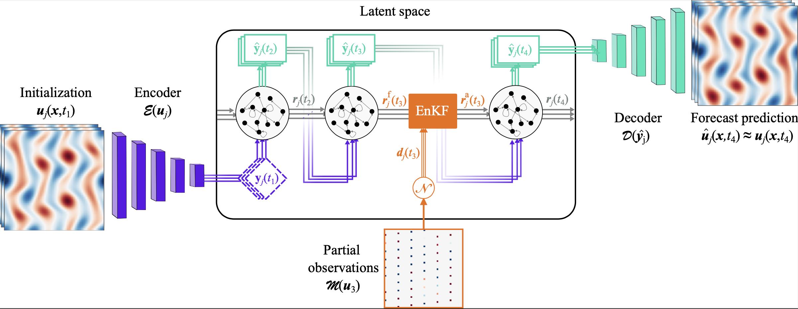

# DA-CAE-ESN

## Introduction

This repository demonstrates the use of data assimilation (DA) within the Convolutional Autoencoder Echo State Network (CAE-ESN) framework. The method assimilates partial and noisy observations into the latent forecast of high-dimensional chaotic systems, enabling real-time and time-accurate predictions of spatiotemporal chaos. Related work can also be found in [Magrilab LatentStability](https://github.com/Magrilab/LatentStability).
<p align='center'>

</p>

If you use this repository, please cite the following work  [arXiv](https://arxiv.org/abs/2508.08729), [published version](https://doi.org/10.1016/j.cma.2025.118600):

> Özalp, E., Nóvoa, A., & Magri, L. (2026). 
> *Real-time forecasting of chaotic dynamics from sparse data and autoencoders.*  
> Computer Methods in Applied Mechanics and Engineering, 450, 118600.

```bibtex
@article{ozalp2026real,
  title={Real-time forecasting of chaotic dynamics from sparse data and autoencoders},
  author={{\"O}zalp, Elise and N{\'o}voa, Andrea and Magri, Luca},
  journal={Computer Methods in Applied Mechanics and Engineering},
  volume={450},
  pages={118600},
  year={2026},
  publisher={Elsevier}
}
```
### Components
This framework consists of three main components:
- **CAE training**  
  Learns a compact latent representation of the full-state dynamics.

- **ESN training**  
  Forecasts the temporal evolution in the latent space.

- **Ensemble Kalman Filter (EnKF)**  
  Performs data assimilation by correcting latent forecasts using sparse and noisy observations.

### Demonstrated Systems
We demonstrate the method on two prototypical chaotic systems:
- **Kuramoto–Sivashinsky (KS) equation** 
- **2D Kolmogorov flow**


## Requirements
To run the code in this repository, you will need the following packages:

```
numpy
scipy
torch
matplotlib
einops
```
